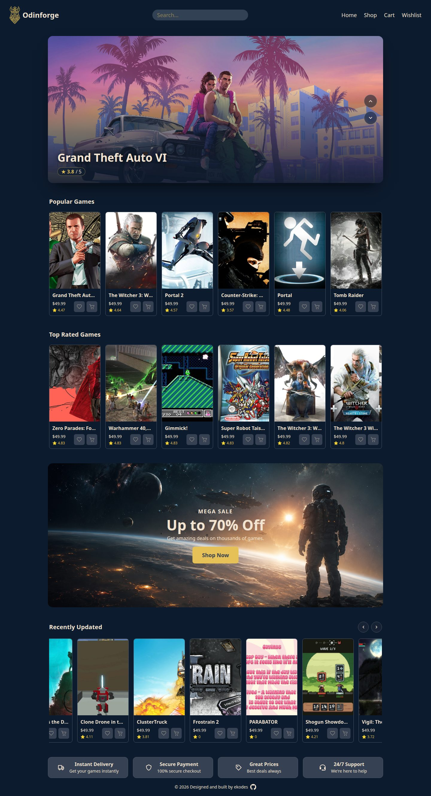
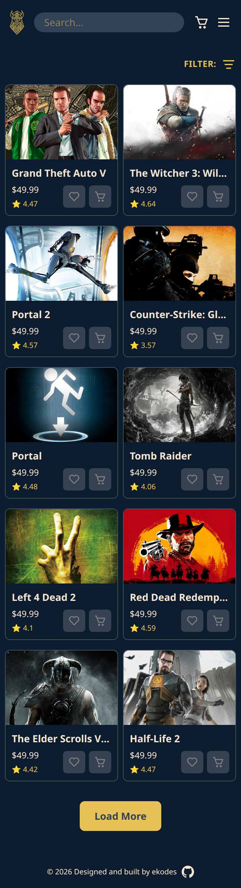
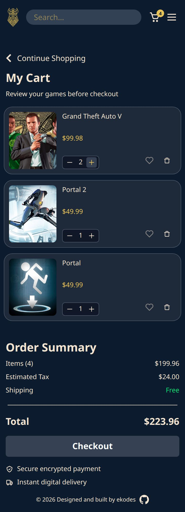
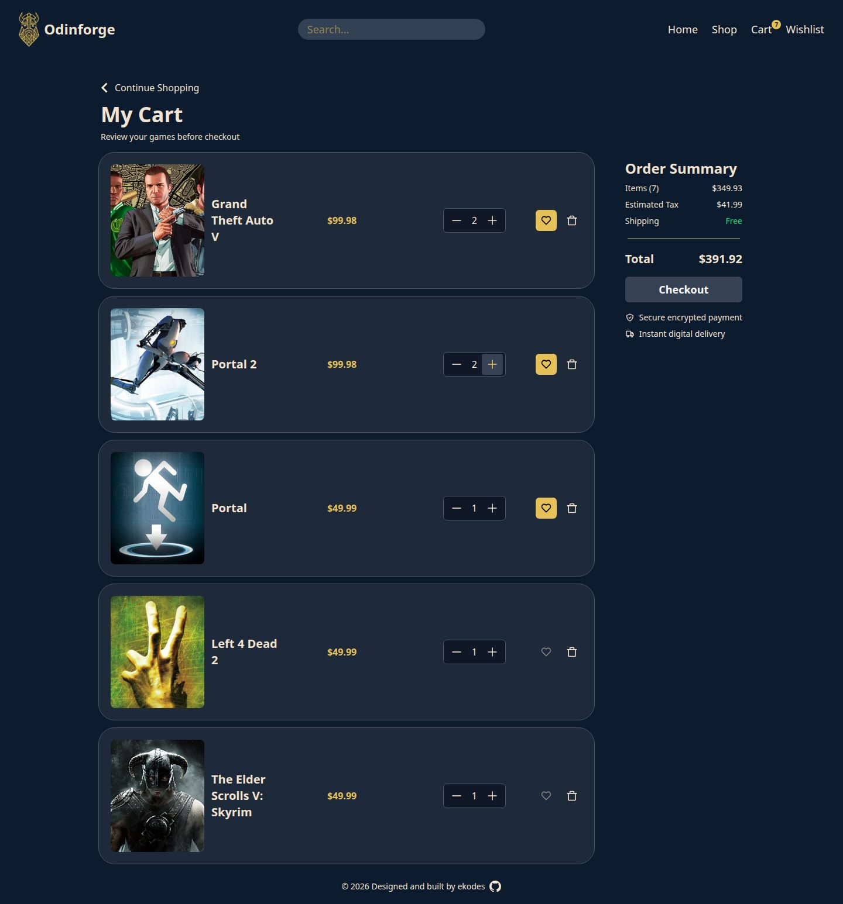
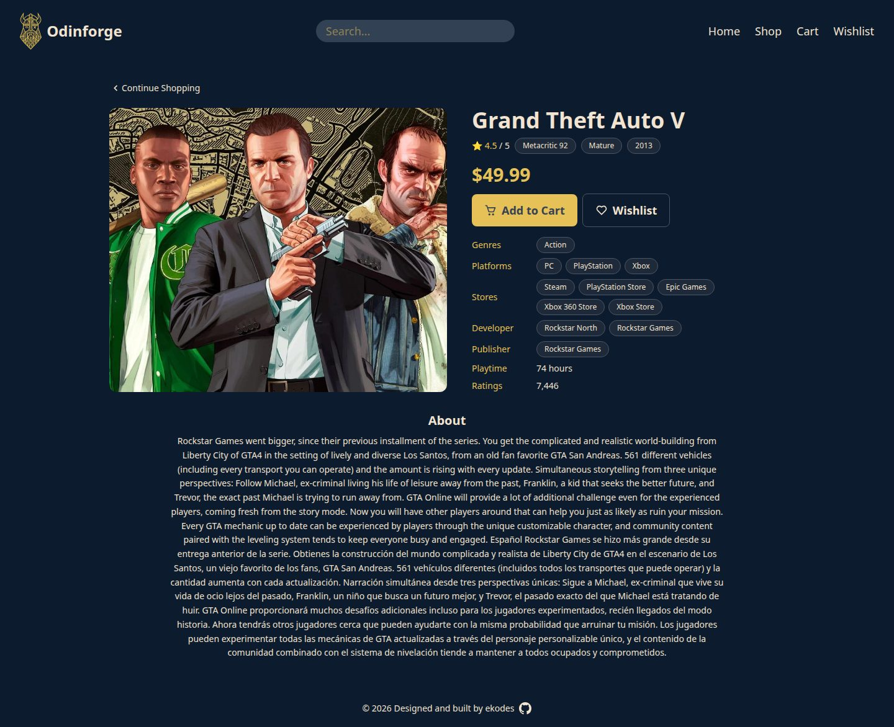
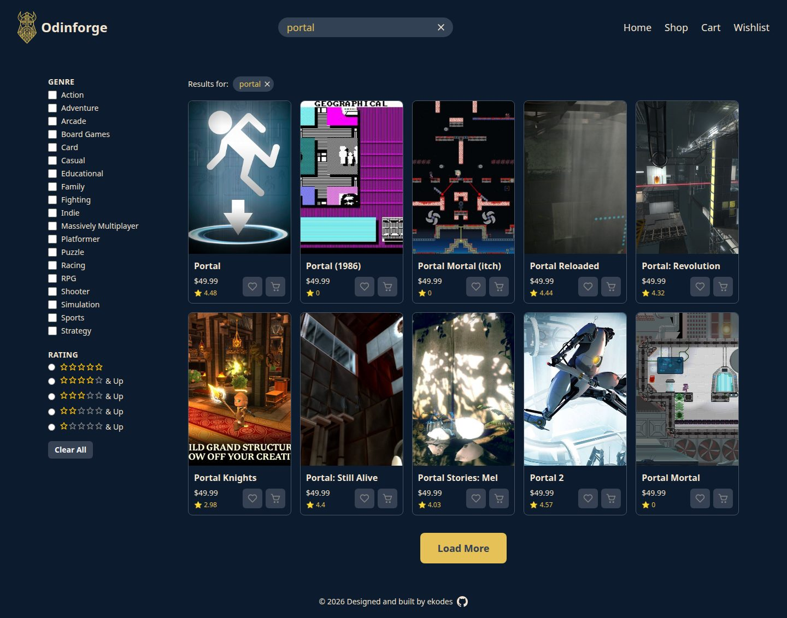

# Project: Shopping Cart

## Overview

Odinforge is a mock game store built with React and TypeScript. It features game browsing, search and filtering, game details, a shopping cart, and a wishlist, with a responsive interface and API integration.

[Odinforge](https://krig6.github.io/odin-shopping-cart/) - Where great games forge great collections!

## Technologies Used

- **React** — Component-based UI library
- **TypeScript** — Type-safe JavaScript
- **Tailwind CSS** — Utility-first CSS framework
- **Vite** — Build tool and development server
- **React Router** — Client-side routing and nested layouts
- **React Context** — Shared cart and wishlist state
- **Fetch API** — Asynchronous data fetching with request cancellation
- **Skeleton Loading** — Placeholder UI while game data loads
- **RAWG API** — Game data, genres, and images
- **Embla Carousel** — Slideshow carousels with autoplay
- **Boxicons React** — Icons
- **ESLint** — Linting and static analysis
- **Prettier** — Code formatting
- **gh-pages** — GitHub Pages deployment

## Features

- **Hero carousel** — Looping vertical slideshow of recent releases with autoplay every 5s and prev/next arrows
- **Popular Games** — Six most recently added games in a horizontal scroller that becomes a grid on large screens
- **Top Rated Games** — Six highest-rated games based on RAWG's rating
- **Recently Updated** — Free-drag horizontal carousel of the 10 latest game updates
- **Mega Sale CTA** — Responsive promo banner linking to the shop, with a separate mobile crop
- **Store features** — Trust row covering instant delivery, secure payment, great prices, and 24/7 support
- **Game search** — Submit a query from the header to jump to filtered shop results, with a clearable results chip
- **Genre filtering** — Multi-select across 19 genres, sent to the API as a combined filter
- **Rating filtering** — Filter the loaded page by a 5-to-1 star minimum
- **Load More pagination** — Appends ten games at a time, hidden once the full result set is loaded
- **Game detail pages** — Hero art, rating, Metacritic and ESRB information, release year or TBA, price, and description
- **Detail metadata** — Genres, platforms, stores, developer, publisher, playtime, and ratings count as chips
- **Shopping cart** — Add or remove games, adjust quantities, and see a live item count badge in the header
- **Auto-removal at zero** — Dropping a quantity below one removes the line from the cart
- **Order summary** — Item count, subtotal, 12% estimated tax, free shipping, and a grand total
- **Wishlist** — Save games with a heart toggle and add them to the cart from the wishlist page
- **Add-to-cart and wishlist toggles** — Available on game cards and detail pages, reflecting current state in the label
- **Loading skeletons** — Shimmering placeholders for grids, carousels, cards, and the detail page
- **Background refetching** — The grid dims and extends with skeletons while new results stream in
- **Error and empty states** — Alert regions with a Try Again retry, plus tailored messages for empty carts, wishlists, and searches
- **Client-side routing** — Home, shop, cart, wishlist, and game detail routes with a catch-all not found page
- **Mobile filter drawer** — Filters slide in fullscreen on small screens and lock page scroll, becoming a sidebar at `lg` and above
- **Stale request protection** — Aborted and superseded API responses are discarded so the UI never shows outdated data
- **Mock data fallback** — Flip one flag in `config.ts` to run the app without an API key
- **Responsive layout** — Adapts from mobile to desktop across navigation, grids, carousels, and filters
- **Accessibility** — Labelled icon buttons, `role`/`aria` states for loading and errors, and visible focus rings
- **Reduced motion support** — Skeleton shimmer animations are disabled when the user prefers reduced motion

## Screenshots

All screenshots use live data from the RAWG API.

<table>
    <tr>
        <td align="center"> Homepage</td>
        <td align="center"> Mobile shop</td>
        <td align="center"> Mobile cart</td>
    </tr>
    <tr>
        <td align="center"> Cart and order summary</td>
        <td align="center"> Game detail</td>
        <td align="center"> Search results</td>
    </tr>
</table>

## Learning Path

This project has been a big step in my learning journey. I got to work with React hooks, the Context API, TypeScript, and API integration in a way that felt much closer to a real-world application. I learned to separate API requests from the service layer, rather than having components interact directly with the RAWG API, which gave me a better understanding of how applications can be structured and maintained.

One of the more stressful parts of the project was when the RAWG API went down for an extended period. I seriously considered switching to another API, but that would have meant adapting my data types and potentially changing parts of the UI I had already designed around RAWG's data. Instead, I came up with the idea of using placeholders and mock data so I could keep developing while the API was unavailable. Fortunately, RAWG eventually came back online.

That experience made the project feel much more like working on something for a real client. You don't always get to control the services your application depends on, and sometimes you have to find a way to keep moving forward when something unexpected breaks.

This project also introduced me to OpenCode and AI coding agents. I started using them to help with debugging and later parts of the project, while still trying to understand the code and decisions behind what I was building.

One thing I learned is that simply prompting an AI does not always give you exactly what you want. The generated code still needs to be reviewed, tweaked, debugged, and often styled or refined by you. But it definitely helps and can make building much faster.

It also made me think about how software development is changing. Coding can be easier with AI, but engineering can become harder. You now have to review and audit AI-generated code, understand what it is doing, and deal with a much larger scope of work that can be handled at once. That can increase the cognitive load even while reducing the time spent writing code. Like any tool, AI has its pros and cons, and I think we all have to learn how to adapt and use it responsibly.

I really enjoyed building this project. It has given me a chance to practice a lot of things I want to get better at, and there is still plenty more to learn. I'm looking forward to improving my understanding of skeleton loading, React hooks, the Context API, TypeScript, and Tailwind CSS, while also learning how to better leverage AI as a tool in my development workflow.

For now, the goal is simple: keep going, keep practicing, and keep building.

## Future Enhancements

A short list of what I'd like to add next, none of it built yet.

- **Persist the cart and wishlist** — both are wiped on every refresh today, so hydrate them from `localStorage`.
- **Add a real checkout flow** — the Checkout button in the order summary is currently a placeholder with no handler.
- **Give each game its own price** — every game shares one flat `GAME_PRICE` from `src/config.ts` today.
- **Add tests and CI** — no test framework is configured, so add Vitest for the providers and services and run lint, test, and build on every push.
- **Cache and de-duplicate API requests** — the homepage fires four separate requests on every mount and refetches everything on each visit.

## Customization

- Point the app at a different API or swap your API key in `.env` and `src/config.ts`
- Run the whole app without an API key by setting `USE_MOCK_DATA = true` in `src/config.ts`
- Edit the five fallback games in `src/data/mockGames.ts` and swap their artwork in `src/assets/images/carousel/`
- Change the flat game price with `GAME_PRICE` in `src/config.ts`, or give each game its own price in the mapping
- Add, rename, or remove genres in `src/components/Shop/GenreFilter.tsx`
- Change how many games each homepage section requests in `src/components/GameShowcase/`
- Change how many games a page loads in `src/components/Shop/Shop.tsx`
- Tune the hero carousel — autoplay interval, axis, and starting slide — in `src/components/Carousel/EmblaCarousel.tsx` and `src/components/Homepage/Homepage.tsx`
- Reorder or remove homepage sections in `src/components/Homepage/Homepage.tsx`
- Adjust the tax rate in `src/context/CartProvider.tsx` and the shipping line in `src/components/Collection/OrderSummary.tsx`
- Recolor the theme by editing the background in `src/index.css` and the accent hex values used across `src/`
- Slow down or disable the skeleton shimmer in the `--animate-shimmer` block in `src/index.css`
- Replace the logo, fallback artwork, and sale banner in `src/assets/images/`
- Update the page title and add a favicon in `index.html`
- Point the footer link at your own GitHub profile in `src/components/Footer.tsx`

## Contributing

Contributions are welcome!

If you'd like to improve this project:

1. Fork the repo
2. Create a feature branch
3. Make your changes
4. Test your updates
5. Open a pull request describing what you changed

## Resources and Tools

- [The Odin Project](https://www.theodinproject.com/) – Guided full-stack curriculum that inspired the project structure.
- [Neovim](https://neovim.io/) – Text editor used for coding and workflow efficiency.
- [opencode](https://opencode.ai) – AI coding agent in the terminal, used to debug issues and build out the later parts of the app.
- [RAWG API](https://rawg.io/apidocs) – REST API providing game details, genres, ratings, and artwork.
- [Embla Carousel](https://www.embla-carousel.com/) – Carousel library behind the hero slideshow and the recently updated scroller.
- [Boxicons](https://boxicons.com/) – Icon set used throughout the header, shop filters, and cart controls.
